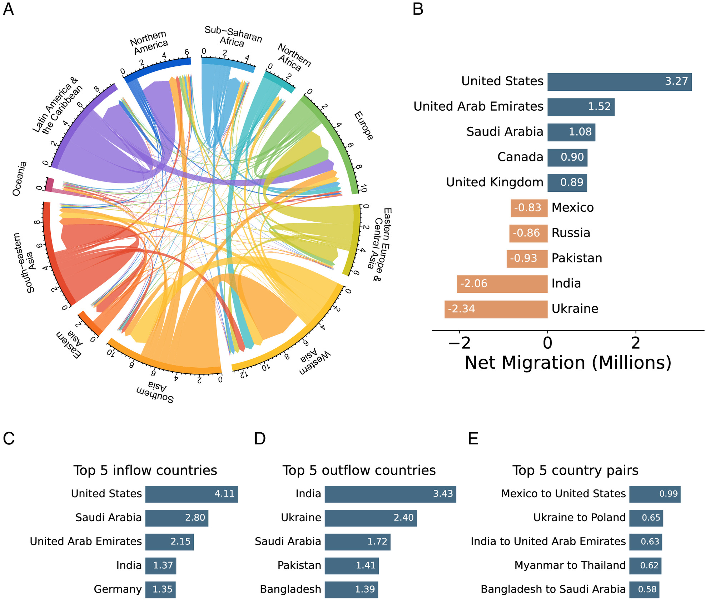

# 🌍 Migration Flow Visualization

[](https://doi.org/10.1073/pnas.2409418122)
[](https://data.humdata.org/dataset/international-migration-flows)
[]()

An exploration repository focused on data discovery and visualization of migration flows. This project serves as a proof of concept for understanding and visualizing complex migration patterns through interactive data representations.

> 🚀 **Goal**: Transform complex global migration data into intuitive, interactive visualizations that reveal hidden patterns and insights.

## Overview

This repository contains experimental work around migration flow visualization, starting with a dataset from [Chi et al. (2025) "Measuring global migration flows using online data"](https://doi.org/10.1073/pnas.2409418122). The project aims to explore different approaches to representing migration data and discovering insights through various visualization techniques.

**Note**: This is primarily an exploration and proof-of-concept project. Future work will include validation using additional datasets beyond the initial paper's data.

## 📊 What We're Working With

The project is based on research that uses online data to measure global migration flows

<div align="center">
  
  <p><em>Figure 2: Global migration flow patterns from Chi et al. (2025) - showcasing the complexity and richness of migration data that this project aims to make more accessible through interactive visualization.</em></p>
</div>

## 🏗️ Repository Structure

The repository is organized into two main components:

### 🐍 Data Processing
- **Python Scripts**: Collection of scripts for data transformations, aggregations, and calculations
- **Data Pipeline**: Initial data processing and preparation for visualization
- **Analytics**: Statistical analysis and pattern discovery tools

### 🎨 Visualization Interface
- **Interactive Dashboard**: Full-featured interface showcasing various visualization experiments
- **Flow Visualizations**: Examples of different approaches to representing migration flows
- **Exploratory Tools**: Interactive components for data exploration and discovery

## 🚀 Getting Started

```bash
# Clone the repository
git clone https://github.com/your-username/migration-viz.git
cd migration-viz

# Setup instructions will be added as components are developed
```

*Detailed documentation for setup and usage will be added as the project develops.*

## 📈 Data Source

This project begins with data made available through [Chi et al. (2025)](https://doi.org/10.1073/pnas.2409418122). All initial explorations and visualizations are based on this foundational dataset. The anonymized aggregated data and global migration flow estimates are available through the [Humanitarian Data Exchange platform](https://data.humdata.org/dataset/international-migration-flows).

## 🛣️ Future Development

- 🔍 **Validation**: Additional migration datasets integration
- 🎯 **Enhanced Visualizations**: Advanced interactive techniques and animations  
- ⚡ **Extended Processing**: More sophisticated data transformation capabilities
- 🚀 **Performance**: Optimizations for larger datasets and real-time updates
- 🌐 **Multi-source**: Integration with multiple migration data providers

## 🤝 Contributing

This is an experimental repository. Contributions and suggestions for visualization approaches are welcome!

- 💡 **Ideas**: Share your visualization concepts and approaches
- 🐛 **Issues**: Report bugs or suggest improvements
- 🔧 **Code**: Submit pull requests for enhancements
- 📊 **Data**: Suggest additional datasets or data sources

## 🙏 Acknowledgments

This project is built upon the groundbreaking work by:

> **G. Chi, G.J. Abel, D. Johnston, E. Giraudy, & M. Bailey**  
> *"Measuring global migration flows using online data"*  
> Proc. Natl. Acad. Sci. U.S.A. 122 (18) e2409418122 (2025)  
> https://doi.org/10.1073/pnas.2409418122

### 📚 Data and Materials Availability

The individual-level data used to construct these estimates are not publicly available due to restrictions by the data provider. However, the following resources are available:

- 🔬 **Replication Materials**: Scripts to generate the plots from the paper  
  → [Harvard Dataverse](https://doi.org/10.7910/DVN/LPA925)

- 📊 **Anonymized Data**: Aggregated data and global migration flow estimates  
  → [Humanitarian Data Exchange](https://data.humdata.org/dataset/international-migration-flows)

- 📖 **Supporting Documentation**: Complete appendix with detailed methodology  
  → [PNAS Supplementary Materials](https://www.pnas.org/doi/suppl/10.1073/pnas.2409418122/suppl_file/pnas.2409418122.sapp.pdf)

---

*We gratefully acknowledge the authors for making their research and data accessible to the scientific community, enabling projects like this to build upon their important work.* 🌍
